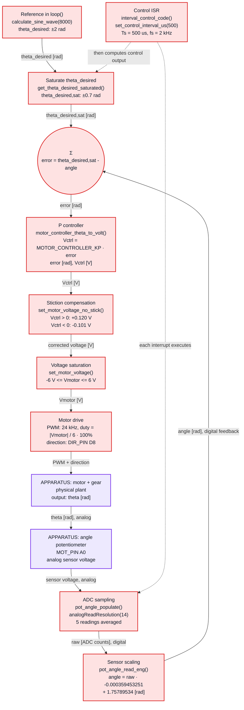

```mermaid
flowchart TB
    REF["Reference in loop()<br/>calculate_sine_wave(8000)<br/>theta_desired: ±2 rad"]
    LIMIT["Saturate theta_desired<br/>get_theta_desired_saturated()<br/>theta_desired,sat: ±0.7 rad"]
    SUM(("Σ<br/>error = theta_desired,sat - angle"))
    P["P controller<br/>motor_controller_theta_to_volt()<br/>Vctrl = MOTOR_CONTROLLER_KP · error<br/>error [rad], Vctrl [V]"]
    STICK["Stiction compensation<br/>set_motor_voltage_no_stick()<br/>Vctrl > 0: +0.120 V<br/>Vctrl < 0: -0.101 V"]
    VOLT["Voltage saturation<br/>set_motor_voltage()<br/>-6 V <= Vmotor <= 6 V"]
    DRIVE["Motor drive<br/>PWM: 24 kHz, duty = |Vmotor| / 6 · 100%<br/>direction: DIR_PIN D8"]

    MOTOR["APPARATUS: motor + gear<br/>physical plant<br/>output: theta [rad]"]
    POT["APPARATUS: angle potentiometer<br/>MOT_PIN A0<br/>analog sensor voltage"]
    ADC["ADC sampling<br/>pot_angle_populate()<br/>analogReadResolution(14)<br/>5 readings averaged"]
    SCALE["Sensor scaling<br/>pot_angle_read_eng()<br/>angle = raw · -0.000359453251<br/>+ 1.75789534 [rad]"]

    REF -->|"theta_desired [rad]"| LIMIT
    LIMIT -->|"theta_desired,sat [rad]"| SUM
    SUM -->|"error [rad]"| P
    P -->|"Vctrl [V]"| STICK
    STICK -->|"corrected voltage [V]"| VOLT
    VOLT -->|"Vmotor [V]"| DRIVE
    DRIVE -->|"PWM + direction"| MOTOR
    MOTOR -->|"theta [rad], analog"| POT
    POT -->|"sensor voltage, analog"| ADC
    ADC -->|"raw [ADC counts], digital"| SCALE
    SCALE -->|"angle [rad], digital feedback"| SUM

    ISR["Control ISR<br/>interval_control_code()<br/>set_control_interval_us(500)<br/>Ts = 500 us, fs = 2 kHz"]
    ISR -.->|"each interrupt executes"| ADC
    ISR -.->|"then computes control output"| LIMIT

    classDef software fill:#dbeafe,stroke:#2563eb,stroke-width:2px,color:#111827;
    classDef apparatus fill:#dcfce7,stroke:#16a34a,stroke-width:2px,color:#111827;
    classDef nonlinear fill:#fef3c7,stroke:#d97706,stroke-width:2px,color:#111827;
    classDef analog fill:#ede9fe,stroke:#7c3aed,stroke-width:2px,color:#111827;
    classDef digital fill:#fee2e2,stroke:#dc2626,stroke-width:2px,color:#111827;

    class REF,P,ADC,SCALE,DRIVE,ISR software;
    class LIMIT,STICK,VOLT nonlinear;
    class MOTOR,POT apparatus;
    class MOTOR,POT analog;
    class REF,LIMIT,SUM,P,STICK,VOLT,DRIVE,ADC,SCALE,ISR digital;
```
